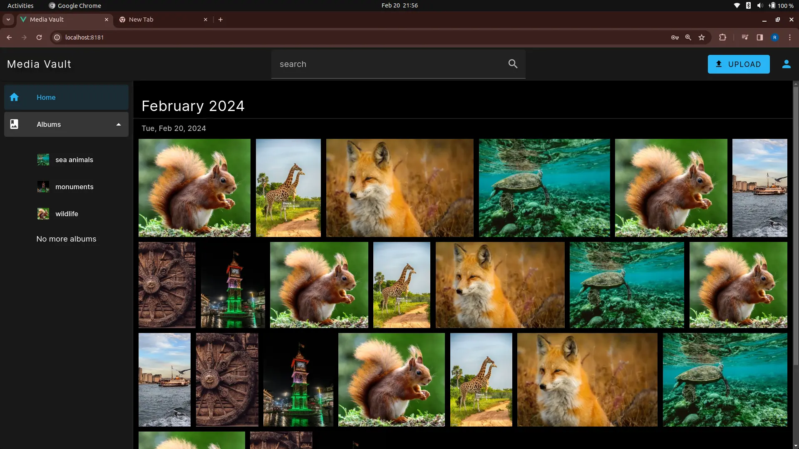
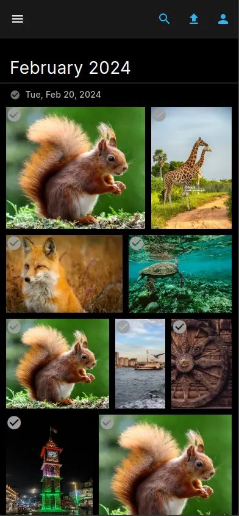

# Media Vault

Self-hosted, end-to-end encrypted user media backups

> **⚠️ Warning**: This project is currently under development. Future versions may contain breaking changes.

  
  

> As of now no mobile app exists; the provided screenshot depicts the browser interface.

## Overview
Media Vault empowers you to take control of your personal media and back it up securely. It provides a self-hosted solution with end-to-end encryption, ensuring your data remains private and accessible only to you.

## Features
* **End-to-end encryption**: Your media files are encrypted both at rest and in transit, safeguarding them from unauthorized access.
* **Self-hosted**: Control where your media resides and who has access, eliminating reliance on third-party cloud storage.
* **User-friendly interface**: Manage your backups with ease through a simple and intuitive web interface.
* **Media organization**: Keep your media organized by creating albums.
* **Search**: Quickly find what you need using powerful search capabilities.

## Key Technologies
* Frontend: **Vue.js**
* Backend: **Golang**
* Database: **PostgreSQL**
* Caching: **Redis**
* Search: **MeiliSearch**
* Authentication and User management: **Keycloak**
* File Storage: **MinIO**

## Getting Started
For detailed instructions on setting up and running Media Vault locally, please refer to our deployment guide: Link to [deployment/README.md](deployment/README.md)

## License
Media Vault is licensed under the MIT LICENSE.

