# Deployment using docker compose

> This guide is intended for setting up Media Vault in a non-production environment for testing and evaluation purposes. 

## Prerequisites:

* **Docker**: Install Docker from https://docs.docker.com/get-started/.
* **Docker Compose**: Install Docker Compose from https://docs.docker.com/compose/install/.

## Steps:

* **Clone the Repository**:
    
    ```bash
    git clone https://github.com/rishabhkailey/media-vault.git
    ```
* **Navigate to the Development Environment**:
    
    ```bash
    cd deployment/development/
    ```
* **Update Secrets (Optional)**:

    The `.env` file contains sensitive information (passwords, database details). If you want to customize these, open and update the file accordingly. Please replace the default passwords in `.env` with unique, strong passwords. They are publicly accessible and pose a security risk.

* **Start the Local Environment:**
    
    ```bash
    docker compose --project-name media-vault up -d
    ```
    This command builds and starts all necessary Docker containers in detached mode (-d), allowing them to run in the background.

    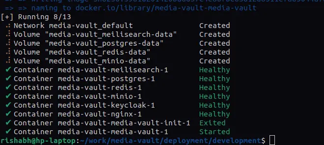

* **Wait for Services**:

    ```bash
    # wait for media-vault service to become healthy
    docker-compose --project-name media-vault ps
    ```
    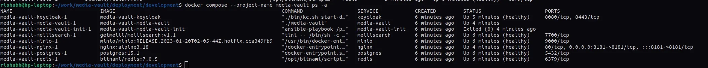


* **Access the Media Vault Application**
    
    Access the Media Vault UI via your web browser at [http://localhost:8181/](http://localhost:8181/). Use the credentials from the `deployment/development/.env` file (`INITIAL_USER` and `INITIAL_USER_PASSWORD` variables) to log in.
    
    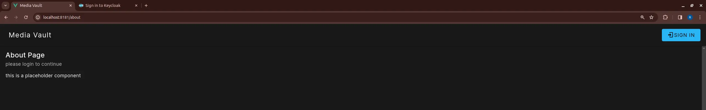
* **Access the Keycloak Admin UI**:
    
    Keycloak handles user management and authentication. Access the admin UI via your web browser at [http://localhost:8181/accounts/admin/](http://localhost:8181/accounts/admin/). Use the credentials from the `deployment/development/.env` file (`ADMIN_USER` and `ADMIN_PASSWORD` variables) to log in.

    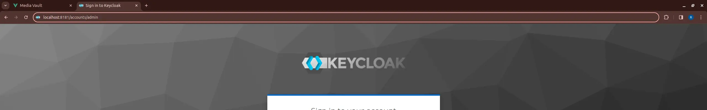


# Running inside VSCode

## Prerequisites:

* **Docker**: Install Docker from [here](https://docs.docker.com/get-started/).
* **Docker Compose**: Install Docker Compose from [here](https://docs.docker.com/compose/install/).
* **Dev Containers extension**: install VSCode Dev container extension from [here](https://marketplace.visualstudio.com/items?itemName=ms-vscode-remote.remote-containers).

## Steps:

* **Clone the Repository**:
    
    ```bash
    git clone https://github.com/rishabhkailey/media-vault.git
    ```

* **Open Backend service in VSCode**
    * open repository directory in VSCode
    * press F1 key and type "reopen in container" and select "Dev containers: Reopen in Container" option
    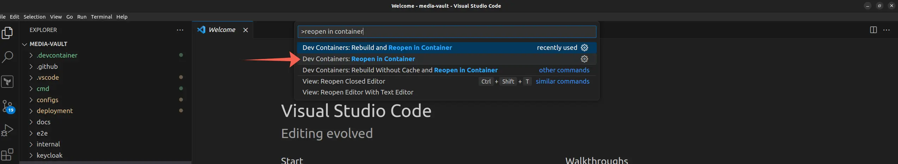
    * select "Go Backedn Service"
    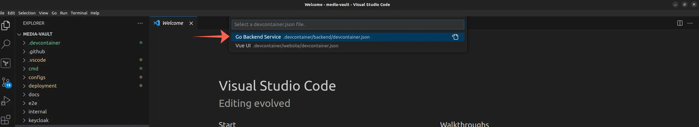
    * wait for VSCode to start and configure required containers

* **Open UI project in VSCode**
    * open repository directory in VSCode (new window)
    * press F1 key and type "reopen in container" and select "Dev containers: Reopen in Container" option
    
    * select "Vue UI"
    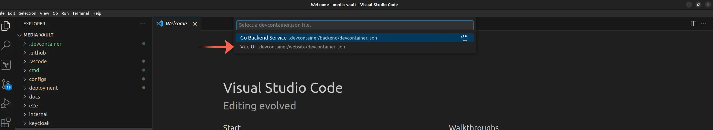
    * wait for VSCode to start and configure required containers
    * if you see a warning from VSCode to reload the window, then click on reload.

* Now we should have 2 separate VSCode windows with all the required dependencies installed and configured. services included are as PostgreSQL, Redis, Keycloak, MinIO, Nginx, Go lang and Node js.
    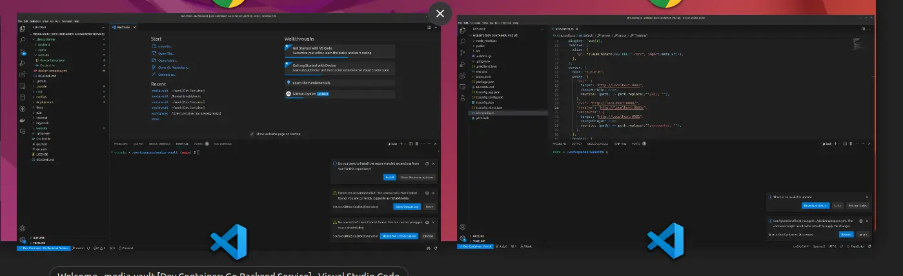
    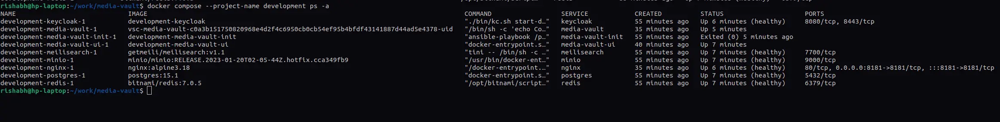

* **Run Backend service**
    * go to "Go Backend Service" VSCode window
    * on left menu bar select "Run and Debug" 
    * from the drop down select "Launch Media Server"
    * Click green play button (▶️)
        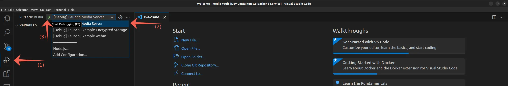
    * output log will be displayed in "DEBUG CONSOLE"
        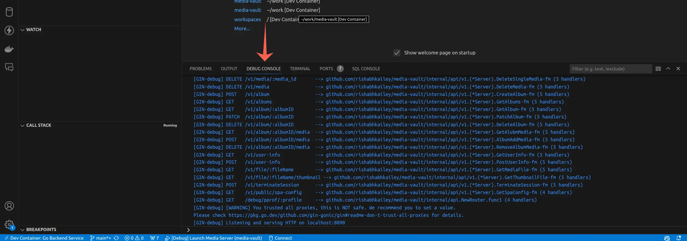

* **Run UI**
    * go to "Vue UI" VSCode window
    * in "TERMINAL" run following commands
    ```bash
    cd src/js/serviceWorker
    npx webpack --mode development --config webpack.config.cjs
    cd ../../..

    yarn install
    yarn run dev
    ```
    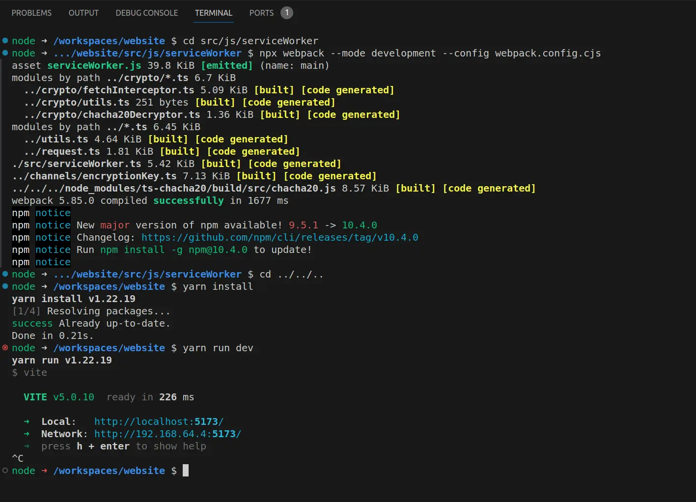


* **Access the Media Vault Application**
    
    Access the Media Vault UI via your web browser at [http://localhost:8181/](http://localhost:8181/). Use the credentials from the `deployment/development/.env` file (`INITIAL_USER` and `INITIAL_USER_PASSWORD` variables) to log in.
    
    
* **Access the Keycloak Admin UI**:
    
    Keycloak handles user management and authentication. Access the admin UI via your web browser at [http://localhost:8181/accounts/admin/](http://localhost:8181/accounts/admin/). Use the credentials from the `deployment/development/.env` file (`ADMIN_USER` and `ADMIN_PASSWORD` variables) to log in.

    